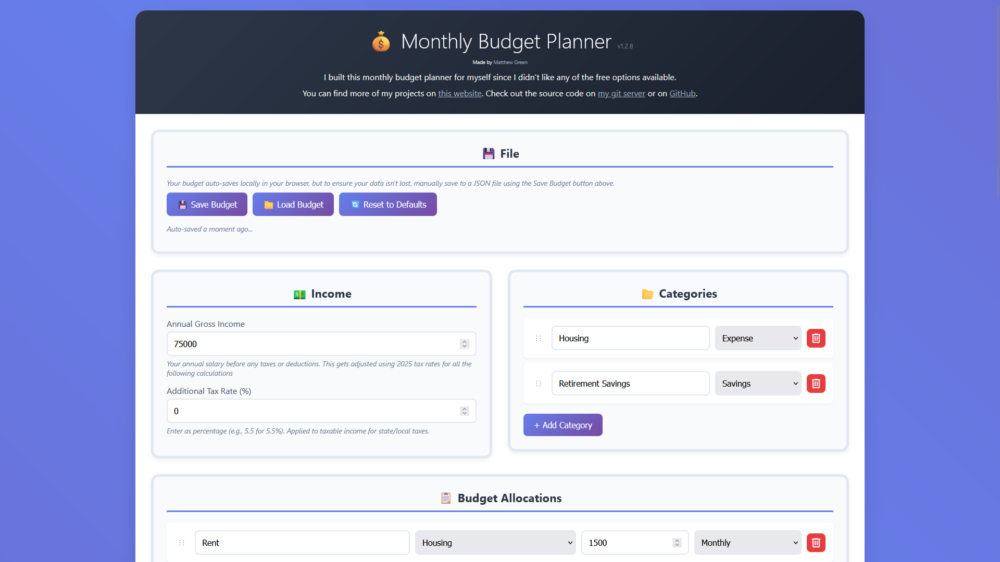
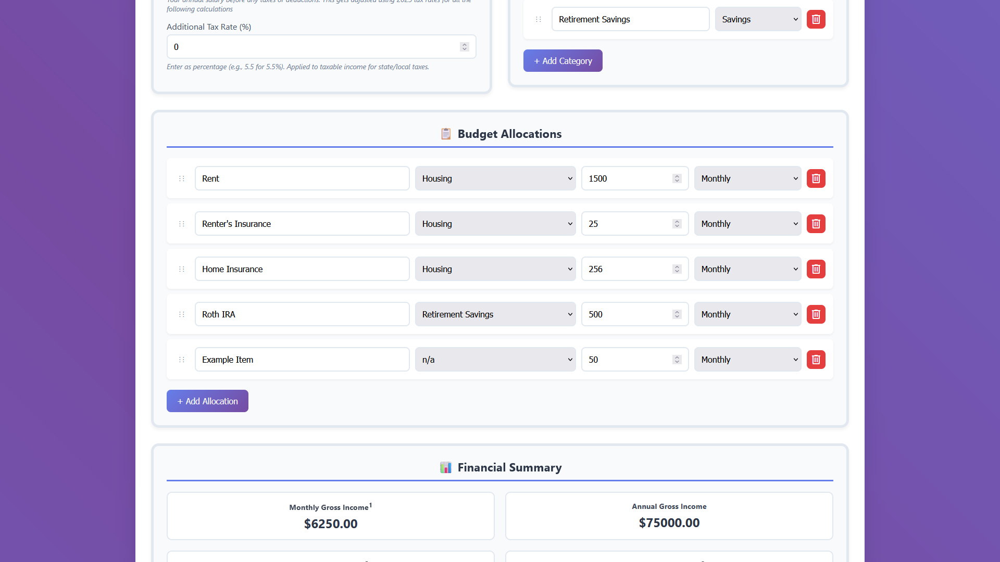
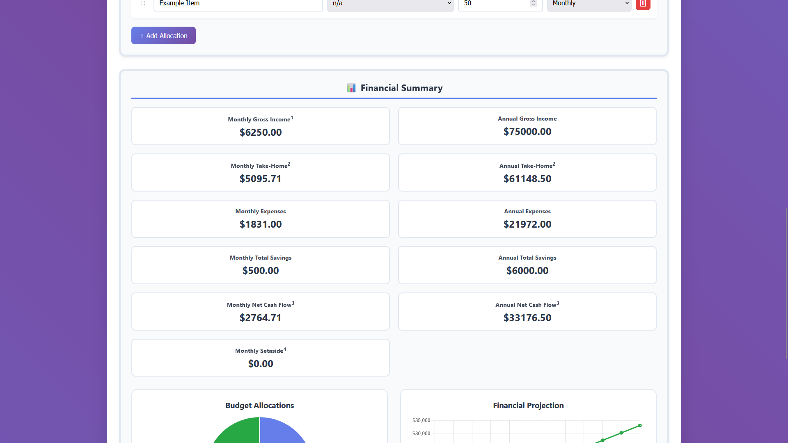
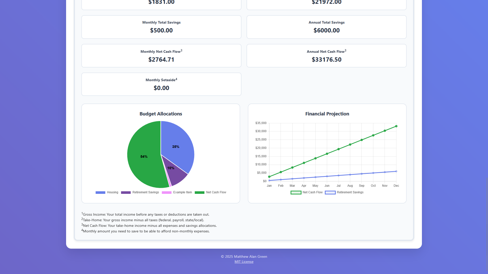

# 💰 Monthly Budget Planner

A clean, interactive web-based budget planner that helps you track income, expenses, and savings with real-time tax calculations and visualizations.

## Features

- **Smart Tax Calculations**: Automatically calculates federal income tax, payroll taxes, and state/local taxes using 2025 tax brackets
- **Interactive Categories**: Create custom expense and savings categories with drag-and-drop reordering
- **Flexible Allocations**: Support for monthly, annual, semi-annual, and bi-monthly expense frequencies
- **Visual Charts**: Real-time pie charts and savings projections
- **Auto-Save**: Your budget automatically saves to browser storage
- **Export/Import**: Save and load budget files as JSON
- **Print-Friendly**: Clean print layouts for physical copies
- **Mobile Responsive**: Works great on phones and tablets

## Screenshots

  
  

  
  

## Usage

1. **Set Your Income**: Enter your annual gross income and any additional tax rates (state/local)
2. **Create Categories**: Add expense and savings categories to organize your budget
3. **Add Allocations**: Create budget items with different frequencies (monthly, annual, etc.)
4. **Review Summary**: Check your financial overview with automatic calculations and charts
5. **Save Your Budget**: Export to JSON file for backup or sharing

## Tax Calculation Details

The planner uses 2025 tax brackets and includes:

- Federal income tax (progressive brackets)
- Social Security tax (6.2% up to wage base)
- Medicare tax (1.45%)
- Additional state/local taxes (configurable rate)
- Standard deduction ($15,000 for single filer)

## License

This project is licensed under the MIT License - see the [LICENSE](LICENSE) file for details.

## Author

**Matthew Green** - [Website](https://matthewgreen.gg/) | [Gitea](https://git.matthewgreen.gg/mgreen/) | [GitHub](https://github.com/greenmatthew/)
